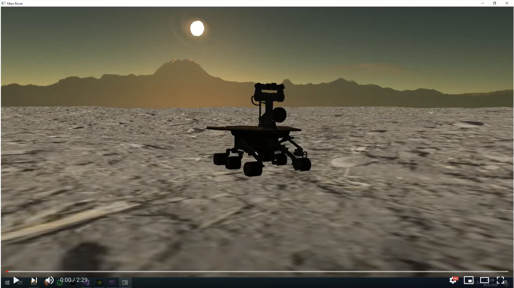

### Mars Rover
Mars rover is a simplistic, physics based simualation of a rover called Oppurtunity. Simulation used Bullet Physics library to simulate vehicle. the terrain the rover moves on is procedurally generated using a Perlin Noise algorithm. The graphic is being rendered with modern OpenGL. Project was created with my own game engine utilizing Component Based System paradigm.

Watch demo here:

## Controls
* W, S to accelerate and brake
* A, D to steer
* Hold Left Mouse Button to rotate camera

## Special thanks
* Mars Rover model: https://sketchfab.com/3d-models/opportunity-0eef63b33e774be6b2ddec9e2e86e2f8
* Skybox: https://gamebanana.com/textures/4390
* Ground texture: https://seamless-pixels.blogspot.com/2013/
